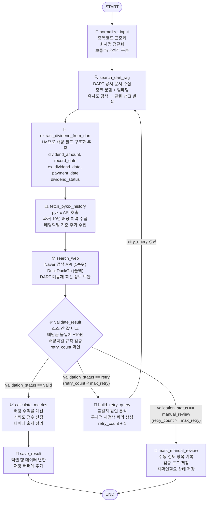
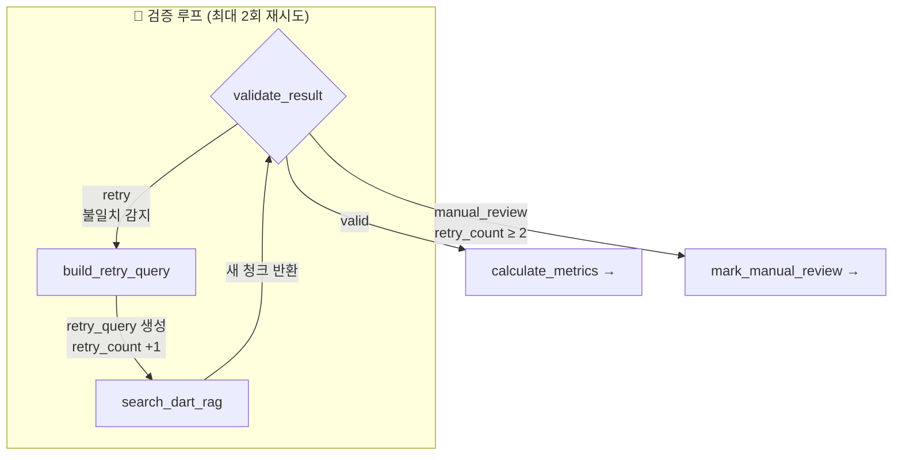
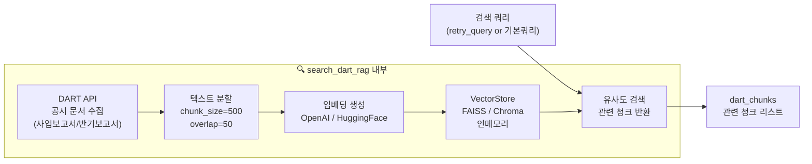
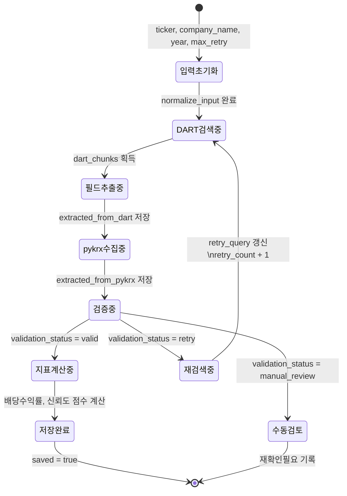
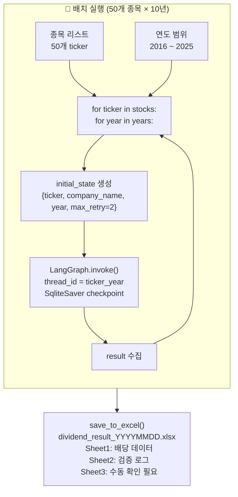
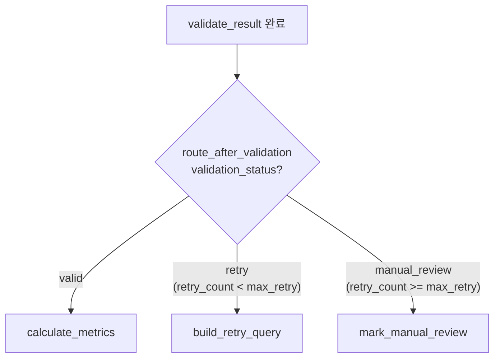
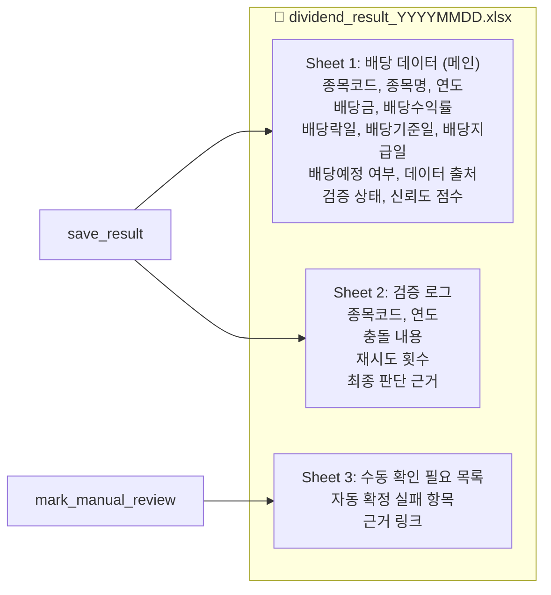

---
tags:
  - LangGraph
  - 배당
  - 아키텍처
  - 다이어그램
created: 2026-04-12
related:
  - "[[requirements]]"
---

# 배당 데이터 수집 에이전트 — LangGraph 다이어그램

---

## 1. 전체 그래프 흐름

---

## 2. 검증 루프 상세

### 재시도 쿼리 전략

| 시도 | 조건 | 쿼리 전략 |
|------|------|----------|
| 1차 (기본) | retry_count = 0 | `"{회사명} {연도} 배당"` |
| 2차 (재시도 1) | 배당금 불일치 | `"{회사명} {연도} 주당배당금 결산 사업보고서 DART"` |
| 2차 (재시도 1) | 배당락일 불일치 | `"{회사명} {연도} 배당기준일 배당락일 공시"` |
| 3차 (재시도 2) | 기타 | `"{회사명} {연도} 배당 결정 공시"` |
| 이후 | retry_count ≥ max_retry | `manual_review` 종료 |

---

## 3. DART RAG 내부 흐름

---

## 4. State 흐름도

---

## 5. 배치 실행 구조

---

## 6. 노드별 입출력 요약

```mermaid
flowchart LR
    subgraph N1["normalize_input"]
        I1["IN: ticker, company_name"] --> O1["OUT: 표준 ticker 6자리\n정규화된 company_name"]
    end

    subgraph N2["search_dart_rag"]
        I2["IN: company_name, year\nretry_query (재시도시)"] --> O2["OUT: dart_chunks[]\ndart_query"]
    end

    subgraph N3["extract_dividend_from_dart"]
        I3["IN: dart_chunks[]"] --> O3["OUT: extracted_from_dart\n{dividend_amount, record_date,\nex_dividend_date, payment_date,\ndividend_status, evidence}"]
    end

    subgraph N4["fetch_pykrx_history"]
        I4["IN: ticker, year"] --> O4["OUT: extracted_from_pykrx\n{dividend_amount, dividend_yield,\npykrx_history}"]
    end

    subgraph N5["validate_result"]
        I5["IN: extracted_from_dart\nextracted_from_pykrx\nretry_count, max_retry"] --> O5["OUT: validation_status\n(valid/retry/manual_review)\nvalidation_reason"]
    end

    subgraph N6["build_retry_query"]
        I6["IN: validation_reason\ncompany_name, year\nretry_count"] --> O6["OUT: retry_query\nretry_count + 1"]
    end

    subgraph N7["calculate_metrics"]
        I7["IN: extracted_from_dart\nextracted_from_pykrx"] --> O7["OUT: dividend_yield\nconfidence_score\nsources[]"]
    end

    subgraph N8["save_result"]
        I8["IN: 전체 state"] --> O8["OUT: saved = true\n엑셀 행 데이터 추가"]
    end

    subgraph N9["mark_manual_review"]
        I9["IN: validation_reason\nretry_count\nextracted_from_dart\nextracted_from_pykrx"] --> O9["OUT: 수동 검토 시트 항목\nvalidation_status = manual_review"]
    end
```

---

## 7. 라우팅 로직

---

## 8. 엑셀 출력 구조

