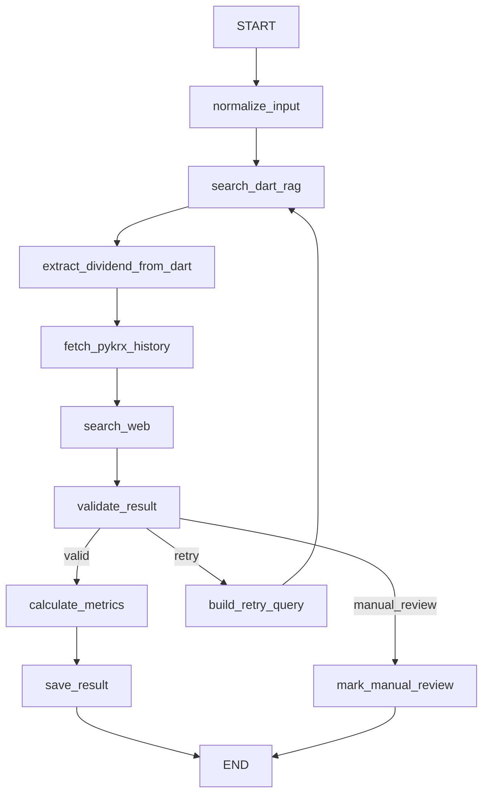

---
tags:
  - LangGraph
  - 배당
  - 요구사항정의
  - MVP
created: 2026-04-12
related:
  - "[[wish8]]"
  - "[[wish8-추가제안]]"
---

# 배당 데이터 수집 에이전트 — 요구 사항 정의서

> [!summary] 프로젝트 핵심
> 선정한 50개 종목의 배당 데이터를 DART(RAG) + 뉴스 검색으로 수집하고,
> LangGraph 검증 루프를 통해 신뢰 가능한 결과를 엑셀로 저장하는 **배당 데이터 검증 에이전트**다.

---

## 1. 프로젝트 개요

### 1-1. 목적

50개 종목에 대해 배당 핵심 데이터를 자동 수집·검증·정리한다.

### 1-2. MVP 범위 (이번 구현 대상)

| 항목 | 포함 여부 | 비고 |
|------|----------|------|
| 과거 10년 배당 이력 수집 | **포함** | 연도별 배당금, 날짜 |
| 올해 배당 데이터 수집 | **포함** | 확정/예정 여부 포함 |
| DART 공시 검색 (RAG) | **포함** | 1차 신뢰 소스 |
| LangGraph 검증 루프 | **포함** | **MVP의 핵심** |
| 엑셀 출력 | **포함** | `.xlsx` 형식 |
| 웹 검색 보조 수집 | **포함** | Naver API / DuckDuckGo — DART 보완 |
| 자사주 소각 데이터 | **추후** | MVP 제외 |
| 배당 추천 기능 | **추후** | MVP 제외 |

---

## 2. 최종 출력 스펙

### 2-1. 엑셀 출력 구조

파일명: `dividend_result_YYYYMMDD.xlsx`

**시트 1: 배당 데이터 (메인)**

| 컬럼 | 타입 | 설명 |
|------|------|------|
| 종목코드 | str | 표준 6자리 코드 |
| 종목명 | str | 회사명 |
| 연도 | int | 기준 연도 |
| 배당금 | float | 주당 배당금 (원) |
| 배당수익률 | float | % (pykrx 기준가 사용) |
| 배당락일 | date | ex-dividend date |
| 배당기준일 | date | record date |
| 배당지급일 | date | payment date |
| 배당예정 여부 | str | 확정 / 예정 / 미확정 |
| 데이터 출처 | str | DART / pykrx / 둘 다 |
| 검증 상태 | str | 검증완료 / 재확인필요 / 수집실패 |
| 신뢰도 점수 | float | 0.0 ~ 1.0 |

**시트 2: 검증 로그**

| 컬럼 | 설명 |
|------|------|
| 종목코드 | |
| 연도 | |
| 충돌 내용 | 어떤 값이 불일치했는지 |
| 재시도 횟수 | |
| 최종 판단 근거 | |

**시트 3: 수동 확인 필요 목록**

자동 확정에 실패한 종목/연도 목록 + 근거 링크

---

## 3. 데이터 소스 정책

### 3-1. 소스별 역할

| 소스 | 역할 | 사용 방식 |
|------|------|----------|
| **DART 공시** | 1차 신뢰 소스 — 날짜·금액 확정 | **RAG** (벡터 검색) |
| **pykrx** | 과거 10년 배당 이력 빠른 수집 | 직접 API 호출 |
| **Naver 검색 API** | DART 미등재 최신 배당 뉴스·공지 보완 | REST API (JSON) |
| **DuckDuckGo 검색** | Naver API 한도 초과 또는 비로그인 폴백 | `duckduckgo-search` 라이브러리 |

### 3-2. DART를 RAG로 사용하는 이유

- 공시 문서는 길고 비정형적이므로 **전체를 LLM에 직접 넣으면 비용·속도 낭비**
- 관련 청크만 검색해서 LLM에 전달하면 **정확한 필드 추출** 가능
- 재검색 시에도 동일 문서를 재활용 → **API 호출 최소화**

```
DART 문서 → 청크 분할 → 임베딩 → VectorStore
                                        ↓
                    검색 쿼리 → 유사도 검색 → 관련 청크 반환
                                        ↓
                              LLM → 구조화 필드 추출
```

---

## 4. LangGraph 에이전트 설계 (MVP 핵심)

### 4-1. 설계 원칙

- LangGraph는 단순 순차 실행이 아닌 **수집 → 검증 → 재시도 → 종료 판단** 흐름 제어기
- 종목-연도 단위로 독립 실행 (병렬화·재시도 관리 용이)
- 무한 루프 방지를 위한 `retry_count` / `max_retry` 명시

### 4-2. 그래프 흐름



### 4-3. State 설계

```python
from typing import Annotated
from typing_extensions import TypedDict
from langgraph.graph.message import add_messages

class DividendAgentState(TypedDict, total=False):
    # 입력 식별자
    ticker: str               # 종목코드
    company_name: str         # 종목명
    year: int                 # 수집 대상 연도

    # 대화/추론 기록 (LangGraph 표준)
    messages: Annotated[list, add_messages]

    # 검색 결과 (RAG)
    dart_chunks: list         # DART RAG 검색 결과 청크
    dart_query: str           # 사용한 검색 쿼리

    # pykrx 과거 데이터
    pykrx_history: dict       # {year: {dividend, div_yield, ...}}

    # 추출된 구조화 값
    dividend_amount: float    # 주당 배당금
    ex_dividend_date: str     # 배당락일
    record_date: str          # 배당기준일
    payment_date: str         # 배당지급일
    expected_dividend_date: str  # 예정일 (미확정 시)
    dividend_status: str      # 확정 / 예정 / 미확정

    # 가공 지표
    dividend_yield: float     # 배당 수익률 (%)

    # 소스별 추출값 (검증 비교용)
    extracted_from_dart: dict
    extracted_from_pykrx: dict
    extracted_from_web: dict       # 웹 검색 결과 (Naver / DuckDuckGo)

    # 웹 검색
    web_search_results: list       # 원본 검색 결과 스니펫
    web_search_provider: str       # "naver" / "duckduckgo"

    # 검증 제어 상태
    validation_status: str    # valid / retry / manual_review
    validation_reason: str    # 충돌 이유 상세
    retry_query: str          # 재검색 쿼리
    retry_count: int          # 현재 재시도 횟수
    max_retry: int            # 최대 재시도 횟수 (기본: 2)

    # 신뢰도
    confidence_score: float   # 0.0 ~ 1.0
    sources: list             # 사용한 소스 목록

    # 최종 저장
    saved: bool
```

### 4-4. Node 상세 설명

#### `normalize_input`

- 종목명 또는 코드를 표준 6자리 코드로 변환
- 보통주/우선주 구분 처리
- 검색 가능한 표준 회사명 반환

```python
def normalize_input(state: DividendAgentState) -> DividendAgentState:
    # 종목코드 표준화 (6자리 zero-padding)
    # 우선주 코드 분리 (005930 vs 005935)
    # DART 검색용 회사명 정규화
    ...
```

#### `search_dart_rag`

**이 Node가 DART RAG의 핵심이다.**

- DART API로 해당 종목/연도의 공시 문서 수집
- 문서를 청크로 분할하고 임베딩
- 검색 쿼리로 관련 청크만 추출

```python
def search_dart_rag(state: DividendAgentState) -> DividendAgentState:
    query = state.get("retry_query") or \
            f"{state['company_name']} {state['year']} 배당"

    # DART 공시 검색
    docs = dart_api.search(
        corp_name=state["company_name"],
        bgn_de=f"{state['year']}0101",
        end_de=f"{state['year']}1231",
        pblntf_ty=["A", "F"]  # 사업보고서, 반기보고서
    )

    # RAG: 관련 청크 추출
    relevant_chunks = rag_retriever.get_relevant_documents(query, docs)

    return {"dart_chunks": relevant_chunks, "dart_query": query}
```

#### `extract_dividend_from_dart`

- DART 청크에서 LLM으로 배당 필드 구조화 추출
- 프롬프트 설계가 정확도를 결정하는 핵심

**프롬프트 설계 원칙:**
1. 필드 의미를 명확히 구분 (배당락일 ≠ 배당기준일)
2. 추출 불가 시 `null` 반환, 추정 금지
3. 출처 문장 함께 반환

```python
EXTRACT_PROMPT = """
다음 공시 문서에서 배당 관련 정보를 추출하라.

[추출 대상 필드]
- dividend_amount: 주당 배당금 (숫자만, 단위: 원)
- record_date: 배당기준일 (YYYY-MM-DD)
- ex_dividend_date: 배당락일 (YYYY-MM-DD)
  * 배당기준일 하루 전 영업일임을 참고할 것
- payment_date: 배당지급일 (YYYY-MM-DD)
- dividend_status: 확정 | 예정 | 미확정

[주의 사항]
- 보통주와 우선주가 섞여 있으면 보통주 기준으로 추출
- 중간배당과 결산배당이 있으면 결산배당 우선
- 값을 확인할 수 없으면 반드시 null로 반환 (추정 금지)
- 각 값의 출처 문장을 evidence 필드에 포함

[공시 내용]
{dart_chunks}

[JSON 형식으로 반환]
"""
```

#### `fetch_pykrx_history`

- pykrx로 과거 10년 배당 이력 수집 (빠른 벌크 수집용)
- 배당락일 기준 주가도 함께 수집 (배당 수익률 계산용)

```python
def fetch_pykrx_history(state: DividendAgentState) -> DividendAgentState:
    from pykrx import stock

    df = stock.get_market_fundamental(
        f"{state['year']}0101",
        f"{state['year']}1231",
        state['ticker']
    )
    # DIV(배당수익률), BPS, PER, PBR 포함

    return {"pykrx_history": df.to_dict()}
```

#### `search_web`

DART에서 데이터를 찾지 못하거나 검증 보완이 필요할 때 웹 검색으로 배당 정보를 추가 수집한다.

- **Naver 검색 API** 우선 시도 (뉴스 + 웹 문서)
- Naver API 실패(한도 초과, 미설정) 시 **DuckDuckGo** 폴백
- 검색 결과 스니펫에서 배당금·날짜 키워드를 정규식으로 1차 필터링 후 LLM 추출

```python
def search_web(state: DividendAgentState) -> DividendAgentState:
    company = state["company_name"]
    year = state["year"]
    query = f"{company} {year} 배당금 배당기준일"

    results = []
    provider = "naver"

    try:
        # 1순위: Naver 검색 API
        results = naver_search(query, display=5)
    except NaverAPIError:
        # 폴백: DuckDuckGo
        provider = "duckduckgo"
        results = ddgs.text(query, max_results=5)

    # 스니펫에서 배당 관련 키워드 필터링
    filtered = [r for r in results if _is_dividend_related(r["description"])]

    return {
        "web_search_results": filtered,
        "web_search_provider": provider,
    }
```

**웹 검색 활용 원칙:**
- DART·pykrx가 모두 `null`인 필드의 보완 소스로만 사용
- 웹 검색 단독으로 확정 판정 불가 → 항상 `신뢰도 페널티 -0.1` 부여
- 출처 URL을 `evidence` 필드에 포함

#### `validate_result`

소스 간 값 비교 및 재시도 판정.

검증 대상:
- 배당금 불일치 (허용 오차: ±10원)
- 배당락일 불일치
- 배당기준일 불일치
- 날짜 규칙 위반: 배당락일 ≠ 배당기준일 - 1 영업일

> **웹 검색 활용 규칙**: DART와 pykrx 모두 `null`인 필드는 `extracted_from_web` 값으로 보완.
> 단, 웹 단독 값은 `confidence_score -= 0.1` 페널티 적용.

```python
def validate_result(state: DividendAgentState) -> DividendAgentState:
    dart = state.get("extracted_from_dart", {})
    pykrx = state.get("extracted_from_pykrx", {})
    web = state.get("extracted_from_web", {})

    issues = []

    # 배당금 비교 (웹 검색으로 보완)
    dart_amt = dart.get("dividend_amount")
    pykrx_amt = pykrx.get("dividend_amount")
    web_amt = web.get("dividend_amount")

    if dart_amt and pykrx_amt:
        diff = abs(dart_amt - pykrx_amt)
        if diff > 10:
            if web_amt:
                issues.append(f"배당금 불일치: DART={dart_amt}, pykrx={pykrx_amt}, web={web_amt} (웹 참고)")
            else:
                issues.append(f"배당금 불일치: DART={dart_amt}, pykrx={pykrx_amt}")

    # 배당락일 규칙 검증
    if dart.get("record_date") and dart.get("ex_dividend_date"):
        if not _validate_ex_date_rule(dart["record_date"], dart["ex_dividend_date"]):
            issues.append("배당락일이 배당기준일 -1 영업일 규칙에 맞지 않음")

    if not issues:
        return {"validation_status": "valid", "validation_reason": ""}

    if state.get("retry_count", 0) >= state.get("max_retry", 2):
        return {"validation_status": "manual_review", "validation_reason": "; ".join(issues)}

    return {"validation_status": "retry", "validation_reason": "; ".join(issues)}
```

#### `build_retry_query`

불일치 원인에 따라 더 구체적인 검색 쿼리 생성.

```python
def build_retry_query(state: DividendAgentState) -> DividendAgentState:
    reason = state.get("validation_reason", "")
    company = state["company_name"]
    year = state["year"]

    if "배당금 불일치" in reason:
        query = f"{company} {year} 주당배당금 결산 사업보고서 DART"
    elif "배당락일" in reason:
        query = f"{company} {year} 배당기준일 배당락일 공시"
    else:
        query = f"{company} {year} 배당 결정 공시"

    return {
        "retry_query": query,
        "retry_count": state.get("retry_count", 0) + 1
    }
```

#### `calculate_metrics`

배당 수익률 등 가공 지표 계산.

#### `save_result`

최종 결과를 엑셀 행 데이터로 변환 후 저장 버퍼에 추가.

#### `mark_manual_review`

자동 확정 실패 항목을 수동 검토 시트에 기록.

### 4-5. 라우팅 함수

```python
def route_after_validation(state: DividendAgentState) -> str:
    status = state.get("validation_status")
    if status == "valid":
        return "calculate_metrics"
    if status == "retry":
        return "build_retry_query"
    return "mark_manual_review"
```

---

## 5. 도구 함수 (Tools) 상세 정의

> [!important] MVP에서 검색 관련 도구 함수는 에이전트 정확도의 핵심이다.

### 5-1. DART RAG 도구

```python
@tool
def search_dart_disclosure(
    company_name: str,
    year: int,
    query: str,
    report_type: str = "사업보고서"
) -> list[dict]:
    """
    DART 공시에서 배당 관련 청크를 RAG로 검색한다.

    Args:
        company_name: 회사명 (예: "삼성전자")
        year: 대상 연도 (예: 2024)
        query: 검색 쿼리 (예: "주당배당금 배당기준일")
        report_type: 보고서 종류 (사업보고서 / 반기보고서 / 배당결정공시)

    Returns:
        관련 청크 리스트 [{"content": ..., "source": ..., "score": ...}]
    """
```

**구현 세부:**
- `dart-fss` 또는 DART OpenAPI로 공시 문서 수집
- `langchain.text_splitter`로 청크 분할 (chunk_size=500, overlap=50)
- `FAISS` 또는 `Chroma`로 인메모리 벡터 스토어
- `OpenAIEmbeddings` 또는 `HuggingFaceEmbeddings`로 임베딩

### 5-2. pykrx 배당 이력 조회 도구

```python
@tool
def get_dividend_history(
    ticker: str,
    start_year: int,
    end_year: int
) -> dict:
    """
    pykrx로 특정 종목의 연도별 배당 이력을 조회한다.

    Args:
        ticker: 종목코드 6자리 (예: "005930")
        start_year: 시작 연도 (예: 2015)
        end_year: 종료 연도 (예: 2025)

    Returns:
        {year: {dividend_amount, dividend_yield, ...}}
    """
```

### 5-3. 종목 정규화 도구

```python
@tool
def normalize_ticker(
    query: str
) -> dict:
    """
    종목명 또는 코드를 표준 코드와 회사명으로 변환한다.

    Args:
        query: 종목명 또는 코드 (예: "삼성전자", "005930")

    Returns:
        {"ticker": "005930", "company_name": "삼성전자", "market": "KOSPI"}
    """
```

### 5-4. 배당락일 규칙 검증 도구

```python
@tool
def validate_ex_dividend_date(
    record_date: str,
    ex_dividend_date: str
) -> dict:
    """
    배당락일이 배당기준일 -1 영업일인지 검증한다.
    한국 증시 규칙: 배당락일 = 배당기준일 - 1 영업일

    Args:
        record_date: 배당기준일 (YYYY-MM-DD)
        ex_dividend_date: 배당락일 (YYYY-MM-DD)

    Returns:
        {"valid": bool, "expected_ex_date": str, "diff_days": int}
    """
```

### 5-5. 엑셀 저장 도구

```python
@tool
def save_to_excel(
    results: list[dict],
    validation_logs: list[dict],
    manual_review_items: list[dict],
    output_path: str
) -> str:
    """
    수집 결과를 엑셀 파일로 저장한다.

    시트 구성:
    - Sheet1: 배당 데이터 (메인)
    - Sheet2: 검증 로그
    - Sheet3: 수동 확인 필요 목록

    Returns:
        저장된 파일 경로
    """
```

---

## 6. 프롬프트 설계 원칙

> [!warning] 프롬프트 품질이 데이터 정확도를 결정한다.

### 6-1. 공통 원칙

1. **필드 의미를 명시적으로 구분** — "배당락일과 배당기준일은 다른 날짜"라고 프롬프트에 명시
2. **추정 금지 원칙** — 확인 불가 시 `null` 반환, LLM이 추정하지 않도록 강제
3. **출처 포함 강제** — 각 추출값의 근거 문장을 `evidence` 필드로 함께 반환
4. **JSON 포맷 강제** — 구조화 출력으로 파싱 오류 최소화

### 6-2. 추출 프롬프트 구조 (권장)

```
[역할]
당신은 한국 증시 배당 공시 전문 데이터 추출기다.

[규칙]
1. 반드시 주어진 문서에서만 정보를 추출한다 (외부 지식 사용 금지)
2. 값을 찾을 수 없으면 null로 반환한다 (추정·보간 금지)
3. 보통주 기준 데이터를 우선 추출한다
4. 결산배당과 중간배당이 있으면 결산배당을 우선한다
5. 날짜는 YYYY-MM-DD 형식으로 반환한다

[필드 정의]
- dividend_amount: 1주당 현금 배당금 (원, 숫자만)
- record_date: 배당기준일 (주주 명부 확정 기준일)
- ex_dividend_date: 배당락일 (record_date - 1 영업일)
- payment_date: 실제 배당금 지급일

[문서]
{context}

[출력 형식]
{{"dividend_amount": ..., "record_date": ..., ...,"evidence": "..."}}
```

### 6-3. 재검색 쿼리 생성 프롬프트

```
[상황]
{company} {year}년 배당 데이터 수집 중 다음 문제가 발생했다:
{validation_reason}

[현재 수집된 값]
DART: {extracted_from_dart}
pykrx: {extracted_from_pykrx}

[지시]
불일치를 해소할 수 있는 DART 검색 쿼리를 1개 생성하라.
쿼리는 구체적이고 짧아야 한다 (20자 이내).
```

---

## 7. 기술 스택

| 구분 | 라이브러리 | 용도 |
|------|-----------|------|
| LangGraph | `langgraph` | 에이전트 흐름 제어 |
| LLM | `langchain-openai` | 필드 추출·재검색 쿼리 생성 |
| DART RAG | `dart-fss`, `langchain`, `FAISS` | 공시 검색 및 청크 추출 |
| 과거 데이터 | `pykrx` | 과거 10년 배당 이력 |
| 웹 검색 (1순위) | `requests` + Naver 검색 API | 최신 배당 뉴스·공지 보완 수집 |
| 웹 검색 (폴백) | `duckduckgo-search` | Naver API 불가 시 대체 검색 |
| 영업일 계산 | `pandas-market-calendars` | 배당락일 규칙 검증 |
| 엑셀 출력 | `openpyxl` | 결과 파일 생성 |
| 상태 저장 | `langgraph.checkpoint.sqlite` | 중간 실패 시 재개 |

---

## 8. 배치 실행 구조

```python
# 외부 루프: 50개 종목 순회
# 내부: LangGraph 개별 실행

from langgraph.checkpoint.sqlite import SqliteSaver

checkpointer = SqliteSaver.from_conn_string("checkpoint.db")
graph = builder.compile(checkpointer=checkpointer)

results = []
for ticker, company in stock_list:
    for year in range(2016, 2026):
        config = {"configurable": {"thread_id": f"{ticker}_{year}"}}
        initial_state = {
            "ticker": ticker,
            "company_name": company,
            "year": year,
            "max_retry": 2
        }
        result = graph.invoke(initial_state, config=config)
        results.append(result)

# 최종 엑셀 저장
save_to_excel(results, output_path="dividend_result.xlsx")
```

---

## 9. 재시도 정책

| 시도 | 쿼리 전략 |
|------|----------|
| 1차 (기본) | `"{회사명} {연도} 배당"` |
| 2차 (재시도 1) | 불일치 원인 반영한 구체적 쿼리 |
| 3차 (재시도 2) | 보고서 종류 명시 쿼리 |
| 이후 | `manual_review`로 종료 |

- 재시도마다 `retry_query` 구체화
- 재시도 사유를 `validation_reason`에 기록
- 최대 재시도 초과 시 `재확인필요` 상태로 저장

---

## 10. 제외 범위 (추후 과제)

| 기능 | 이유 |
|------|------|
| 자사주 소각 데이터 수집 | 복잡도 높음, 별도 공시 탐색 필요 |
| 배당 관련 뉴스 수집 | 정형화 어려움, 노이즈 많음 |
| 배당 추천/스크리닝 | 데이터 수집 완료 후 별도 구현 |
| 실시간 데이터 | MVP 범위 외 |

---

## 11. 성공 기준

- 50개 종목 전체에 기본 결과 생성
- 각 데이터 항목에 출처 포함
- 불일치 시 자동 재검색 동작
- 재검색 후에도 불확실한 항목 별도 표시
- 결과가 `.xlsx` 파일로 저장됨
