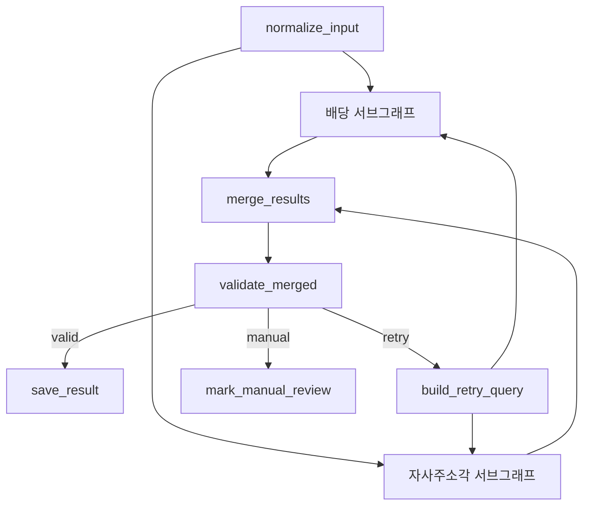
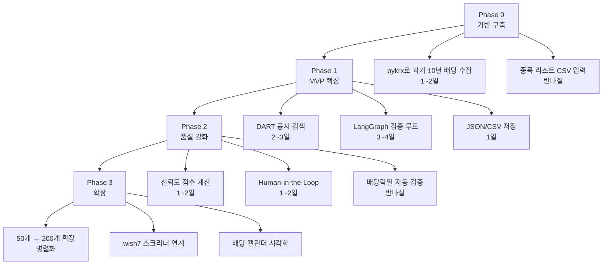

---
tags:
  - LLM
  - LangGraph
  - 배당
  - 주주환원
  - 프로젝트
  - 제안
created: 2026-04-11
related:
  - "[[wish8]]"
  - "[[wish7]]"
---

# wish8 — 추가 제안

> [!abstract] 검토 요약
> [[wish8]] 요건정의서는 구조·범위·검증 로직이 매우 탄탄하다.
> 아래 제안은 **빠진 데이터 항목**, **LangGraph 구조 강화**, **기술 스택** 네 가지 관점에서 보완한다.

---

## 1. 데이터 항목 보강 제안

### 1-1. 현재 누락된 핵심 지표

현재 wish8은 배당 이력·날짜·자사주 소각에 집중하지만,
**투자 판단에 실제로 쓰이는 가공 지표**가 빠져 있다.

| 추가 제안 항목 | 산출 방법 | 필요 이유 |
|--------------|----------|----------|
| **배당 수익률 (DY)** | 배당금 ÷ 주가(배당락일 기준) | 종목 간 비교의 핵심 |
| **배당 성향 (Payout Ratio)** | 배당금 ÷ EPS | 지속 가능성 판단 |
| **배당 성장률 (DGR)** | YoY 배당금 변화율 | 배당 성장주 선별 |
| **총 주주환원율 (TSR)** | (배당 + 자사주 소각) ÷ 순이익 | 실질 주주 친화도 |
| **연속 배당 연수** | 무배당 없이 지급한 연수 | 안정성 지표 |
| **특별배당 여부** | 일회성 배당 플래그 | 정기배당과 혼동 방지 |
| **중간배당 vs 결산배당** | 지급 시기 구분 | 분기 현금흐름 계획용 |

> [!tip] TSR이 중요한 이유
> 자사주 소각은 배당과 합산해야 진짜 주주환원이 보인다.
> `TSR = (배당금 + 자사주 소각 금액) ÷ 시가총액` 으로 계산한다.

---

### 1-2. State 필드 추가 제안

```python
class DividendAgentState(TypedDict, total=False):
    # ... 기존 필드 유지 ...

    # ── 추가 제안 필드 ──────────────────────────
    # 가공 지표
    dividend_yield: float          # 배당 수익률 (%)
    payout_ratio: float            # 배당 성향 (%)
    dividend_growth_rate: float    # 전년 대비 성장률 (%)
    consecutive_dividend_years: int # 연속 배당 연수
    total_shareholder_return: float # TSR (%)

    # 배당 종류 구분
    is_special_dividend: bool      # 특별배당 여부
    interim_dividend: float        # 중간배당금
    final_dividend: float          # 결산배당금

    # 자사주 보강
    buyback_amount: float          # 소각 규모 (억원)
    buyback_shares: int            # 소각 주수
    buyback_date: str              # 소각 완료일

    # 신뢰도
    confidence_score: float        # 0.0 ~ 1.0
    data_completeness: float       # 필수 필드 채워진 비율
```

---

### 1-3. 배당락일 자동 검증 규칙

> [!warning] 한국 배당락일 규칙
> 한국 주식시장에서 배당락일 = **배당기준일 - 1 영업일**이다.
> 이 규칙으로 날짜 오류를 자동 1차 필터링할 수 있다.

```python
def validate_ex_dividend_date(record_date: str, ex_date: str) -> bool:
    """배당락일이 배당기준일 -1 영업일인지 검증한다."""
    from pandas.tseries.offsets import BDay
    import pandas as pd
    expected = pd.Timestamp(record_date) - BDay(1)
    actual = pd.Timestamp(ex_date)
    return expected == actual
```

이 검증을 `validate_result` Node에 추가하면
LLM 없이도 날짜 오류의 상당수를 잡을 수 있다.

---

## 2. LangGraph 구조 강화 제안

### 2-1. Subgraph 분리 (현재: 단일 그래프)

현재 설계는 배당 수집과 자사주 소각 수집이 같은 그래프에 섞여 있다.
두 로직을 **서브그래프로 분리**하면 유지보수와 재사용이 쉬워진다.



```python
# 배당 서브그래프
dividend_builder = StateGraph(DividendAgentState)
dividend_builder.add_node("search_dart", search_dart)
dividend_builder.add_node("search_news", search_news)
dividend_builder.add_node("extract_dividend", extract_dividend_node)
dividend_subgraph = dividend_builder.compile()

# 자사주 서브그래프
buyback_builder = StateGraph(DividendAgentState)
buyback_builder.add_node("search_buyback_dart", search_buyback_dart)
buyback_builder.add_node("extract_buyback", extract_buyback_node)
buyback_subgraph = buyback_builder.compile()

# 메인 그래프에서 서브그래프 노드로 추가
main_builder.add_node("dividend_flow", dividend_subgraph)
main_builder.add_node("buyback_flow", buyback_subgraph)
```

---


---

### 2-3. Checkpointer로 중단-재개 지원

50개 종목을 처리하다 중간에 실패해도 **처음부터 다시 하지 않도록**
`checkpointer`로 중간 상태를 저장한다.

```python
from langgraph.checkpoint.sqlite import SqliteSaver

# SQLite로 중간 상태 영구 저장
checkpointer = SqliteSaver.from_conn_string("wish8_checkpoint.db")
graph = builder.compile(checkpointer=checkpointer)

# 종목별 thread_id로 상태 격리
config = {"configurable": {"thread_id": f"{ticker}_{year}"}}
result = graph.invoke(initial_state, config=config)

# 실패 후 재개 시 동일 thread_id로 호출
result = graph.invoke(None, config=config)  # 중단 지점부터 재개
```

---

### 2-4. Human-in-the-Loop 적용 시점

`interrupt()`를 넣으면 좋은 지점:

| 시점 | 이유 |
|------|------|
| `validate_result` → `manual_review` 직전 | 자동 판단 불가 항목을 사람이 직접 검토 |
| 배당금이 전년 대비 50% 이상 변동 시 | 이상값일 가능성 → 확인 요청 |
| 공시 없이 뉴스만 있는 올해 예정 데이터 | 신뢰도 낮음 → 승인 요청 |

```python
from langgraph.types import interrupt

def validate_result(state: DividendAgentState):
    # ... 검증 로직 ...

    # 이상값 감지 시 사람 확인 요청
    if is_anomaly(state):
        decision = interrupt({
            "ticker": state["ticker"],
            "year": state["year"],
            "issue": "배당금이 전년 대비 50% 이상 변동",
            "dart_value": state["extracted_from_dart"],
            "news_value": state["extracted_from_news"],
        })
        if not decision["approved"]:
            return {"validation_status": "manual_review"}

    return {"validation_status": "valid"}
```

---

## 3. 신뢰도 점수 (Confidence Score) 설계 제안

검증 상태를 `valid / retry / manual_review` 3단계 외에
**0~1 사이 점수**로도 나타내면 우선순위 처리에 유용하다.

```python
def calculate_confidence(state: DividendAgentState) -> float:
    score = 1.0

    # 소스 개수
    if not state.get("dart_docs"):
        score -= 0.3          # 공시 없으면 큰 감점
    if not state.get("news_docs"):
        score -= 0.1

    # 날짜 규칙 검증 통과 여부
    if not validate_ex_dividend_date(...):
        score -= 0.2

    # 재시도 횟수
    score -= state.get("retry_count", 0) * 0.1

    # 올해 예정 데이터
    if state.get("dividend_status") == "예정":
        score -= 0.1

    return max(0.0, score)
```

| 점수 | 의미 | 처리 방안 |
|------|------|----------|
| 0.8 ~ 1.0 | 신뢰 높음 | 자동 저장 |
| 0.5 ~ 0.8 | 보통 | 저장 + 주석 표시 |
| 0.0 ~ 0.5 | 신뢰 낮음 | manual_review 우선 대상 |

---

## 4. wish7 연계 제안

> [!important] wish8 데이터셋 → wish7 스크리너 인풋

wish8이 생성한 배당 데이터셋은 **[[wish7]] 스크리너의 핵심 인풋**이 될 수 있다.


### 연계 시나리오

1. **배당 성장주 스크리너**
   - wish8 데이터 → `연속 배당 연수 ≥ 5년` + `DGR ≥ 5%` 필터
   - wish7 에이전트가 해당 종목 심층 분석

2. **섹터별 TSR 비교**
   - wish8의 TSR 데이터 → 섹터 평균과 비교
   - 섹터 내 주주환원율 상위 종목 자동 추출

3. **배당 캘린더 생성**
   - 50개 종목의 배당락일/지급일로 월별 현금흐름 시뮬레이션

---

## 5. 기술 스택 추가 제안

### 5-1. 데이터 수집 라이브러리

| 라이브러리 | 용도 | 비고 |
|-----------|------|------|
| `pykrx` | 과거 주가·배당 데이터 | KRX 공식 데이터 |
| `dart-fss` | DART API Python 래퍼 | 공시 검색 자동화 |
| `FinanceDataReader` | 주가·재무 데이터 | 네이버·KRX 통합 |
| `pandas-market-calendars` | 영업일 계산 | 배당락일 검증용 |

```python
# pykrx로 과거 배당 데이터 직접 수집
from pykrx import stock

# 삼성전자 배당 이력
df = stock.get_market_fundamental("20150101", "20251231", "005930")
# DIV(배당수익률), BPS, PER, PBR 포함

# dart-fss로 공시 검색
import dart_fss as dart
dart.set_api_key("YOUR_API_KEY")
corp = dart.get_corp_list().find_by_corp_name("삼성전자")[0]
filings = corp.search_filings(bgn_de="20240101", pblntf_ty="A")  # 사업보고서
```

> [!tip] pykrx + dart-fss 조합
> - **pykrx**: 과거 10년 배당 수익률 이력 (빠른 수집)
> - **dart-fss**: 배당 결정 공시·사업보고서 원문 (정확한 날짜/금액 확인)
> - 두 소스를 교차 검증하면 신뢰도 크게 향상

---

### 5-2. 저장 포맷 추가 제안

현재 요건: JSON / CSV / 마크다운 / Obsidian 노트

**추가 제안: DuckDB**

```python
import duckdb

# 로컬 분석용 DB (파일 1개, 설치 불필요)
conn = duckdb.connect("wish8.duckdb")

# 배당 데이터 테이블
conn.execute("""
    CREATE TABLE IF NOT EXISTS dividends (
        ticker VARCHAR,
        company_name VARCHAR,
        year INTEGER,
        dividend_amount DECIMAL,
        ex_dividend_date DATE,
        record_date DATE,
        payment_date DATE,
        dividend_yield DECIMAL,
        confidence_score DECIMAL,
        validation_status VARCHAR,
        sources JSON,
        updated_at TIMESTAMP DEFAULT CURRENT_TIMESTAMP
    )
""")
```

DuckDB 장점:
- 설치 불필요, 파일 1개
- SQL로 즉시 분석 가능
- pandas DataFrame과 완벽 호환
- Obsidian Dataview와 연계 불가 (별도 뷰어 필요)

---

## 6. MVP 우선순위 재정리

wish8 요건정의서의 MVP를 구현 난이도 기준으로 재정렬한 추천 순서:



> [!tip] 권장 시작점
> **Phase 0 먼저** — pykrx로 과거 데이터를 먼저 확보하면
> LangGraph 없이도 기본 데이터셋이 생긴다.
> 이후 LangGraph로 "검증·보완" 레이어를 얹는 순서가 리스크가 낮다.

---

## 7. 검토 시 놓치기 쉬운 엣지 케이스

| 케이스 | 처리 제안 |
|--------|----------|
| **우선주 배당이 보통주보다 높음** | 보통주/우선주를 별도 행으로 저장 |
| **분기 배당 → 연간 합산 필요** | `annual_dividend = sum(quarterly)` 별도 집계 |
| **유상증자로 주수 변경** | 주당 배당금 기준으로 저장 (총 배당금 X) |
| **합병·분할로 종목코드 변경** | 구 코드 → 신 코드 매핑 테이블 필요 |
| **12월 결산 아닌 기업** | 연도 기준을 회계연도로 통일할지 확인 |
| **해외 상장 DR** | 환율 영향으로 배당 수익률 계산 복잡 |

---

## 8. 한 줄 핵심 제안

> [!summary] 추가 제안 요약
> 1. **pykrx 먼저** — LangGraph 전에 과거 10년 데이터 기반 확보
> 2. **TSR 필드 추가** — 배당 + 자사주 소각 합산 지표로 차별화
> 3. **배당락일 규칙 검증** — LLM 없이 날짜 오류 1차 필터링
> 4. **Subgraph 분리** — 배당 / 자사주 소각 로직을 독립 유지보수
> 5. **wish7 연계 설계** — wish8 데이터셋 → 스크리너 인풋으로 활용
