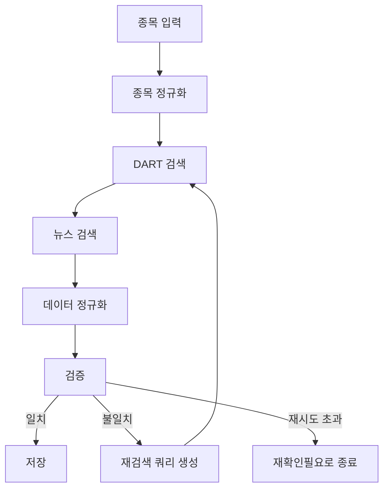
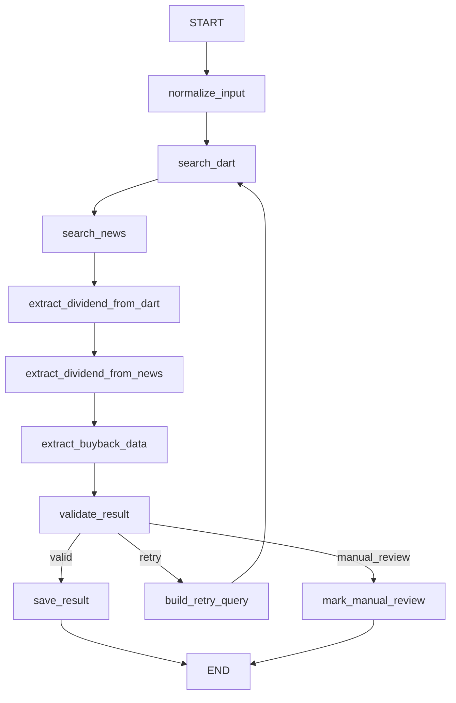

---
tags:
  - LLM
  - LangGraph
  - 배당
  - 데이터수집
  - 프로젝트
created: 2026-04-11
related:
---

# wish8 상세 요건 정의

## 1. 프로젝트 개요

이 프로젝트의 목적은 **선정한 50개 종목에 대해 배당 관련 핵심 데이터를 자동으로 수집·검증·정리하는 시스템**을 만드는 것이다.

수집 대상 데이터는 단순 배당금만이 아니라 다음을 포함한다.

- 과거 10년치 배당 이력
- 배당락일
- 올해 기준 배당금
- 올해 배당지급일
- 올해 배당예정일
- 자사주 소각 여부 및 관련 공시/뉴스

핵심 차별점은 단순 크롤링이 아니라, **LangGraph 기반 검증 루프를 두어 날짜나 금액이 맞지 않으면 재검색/재확인하는 구조**를 갖는 것이다.

---

## 2. 문제 정의

배당 데이터는 다음과 같은 이유로 한 번에 정확히 수집되지 않는 경우가 많다.

- 뉴스 기사와 공시 문서의 표현 방식이 다르다
- 같은 종목이라도 보통주/우선주 데이터가 섞일 수 있다
- 배당기준일, 배당락일, 지급일, 공시일이 혼동되기 쉽다
- 올해 예정 데이터는 아직 확정되지 않았을 수 있다
- 자사주 소각은 배당과 별도 이슈지만 주주환원 관점에서 함께 봐야 한다

따라서 이 프로젝트는 단순 검색기가 아니라, **신뢰 가능한 주주환원 데이터셋 생성기**로 정의해야 한다.

---

## 3. 목표

### 3-1. 최종 목표

50개 종목에 대해 아래 필드를 갖는 구조화된 결과물을 만든다.

| 항목 | 설명 |
|------|------|
| 종목명 | 회사명 |
| 종목코드 | 표준 종목코드 |
| 기준 연도 | 데이터가 속한 연도 |
| 배당금 | 주당 배당금 |
| 배당락일 | ex-dividend date |
| 배당기준일 | record date |
| 배당지급일 | payment date |
| 배당예정 여부 | 예정 / 확정 / 미확정 |
| 데이터 출처 | 뉴스 / DART / 둘 다 |
| 자사주 소각 여부 | 있음 / 없음 / 확인불가 |
| 자사주 소각 관련 근거 | 뉴스 제목, 공시 제목, 링크 등 |
| 검증 상태 | 검증완료 / 재확인필요 / 수집실패 |

### 3-2. 운영 목표

- 가능한 한 **DART를 1차 신뢰 소스**로 사용한다
- 뉴스 검색은 공시 보완 및 최신 예정 정보 확인 용도로 사용한다
- 날짜/금액 충돌 시 자동으로 재검색한다
- 최종 결과에는 반드시 출처와 검증 상태를 남긴다
-

---

## 4. 범위 정의

### 4-1. 포함 범위

- 50개 종목 선정
- 각 종목의 과거 10년치 배당 데이터 수집
- 올해 배당 관련 최신 데이터 수집
- 자사주 소각 관련 뉴스/공시 확인
- 결과를 표 형태 또는 JSON/CSV 형태로 정리
- 종목별 검증 로그 기록
- **결과를 엑셀 && 배당 수익률을  계산하기 하기 위해  가격 입수 ** 

### 4-2. 제외 범위

- 실시간 매매 기능
- 포트폴리오 자동 리밸런싱
- 배당 투자 추천 알고리즘
- 증권사 API 연동 매매
- 모든 상장사 전체 자동 확장

즉, 이 단계는 **정확도 높은 배당/주주환원 데이터 수집 파이프라인 구축**에 집중한다.

---

## 5. 데이터 소스 정책

### 5-1. 1차 소스

- **DART 공시 검색**

우선 사용 이유:

- 가장 공식적인 기업 공시 데이터
- 배당 결정, 정기주주총회, 사업보고서, 주식 소각 관련 정보 확인 가능

### 5-2. 2차 소스

- **뉴스 검색**

사용 목적:

- 공시 발표 이후 시장 기사 표현 보완
- 올해 예정 배당 정보 확인
- 자사주 소각 기사 보완
- 공시에 직접적으로 정리되지 않은 해설성 맥락 확보

### 5-3. 소스 사용 원칙

- 숫자와 날짜는 가능한 한 DART 기준으로 확정한다
- 뉴스는 보조 증거로 활용한다
- 뉴스와 공시가 충돌하면 공시 우선
- 둘 다 불명확하면 `재확인필요` 상태로 남긴다

---

## 6. 핵심 기능 요구사항

### 6-1. 종목 리스트 입력

시스템은 50개 종목 리스트를 입력받아야 한다.

입력 형태 예시:

- 종목명 리스트
- 종목코드 리스트
- CSV 파일
- 수동 입력 테이블

필수 요구사항:

- 종목명과 종목코드를 매핑할 수 있어야 한다
- 중복 종목을 제거해야 한다
- 우선주/보통주 구분이 필요한 경우 명시할 수 있어야 한다

### 6-2. 과거 10년 배당 데이터 수집

각 종목에 대해 과거 10년치 데이터를 수집한다.

수집 항목:

- 연도
- 주당 배당금
- 배당기준일
- 배당락일
- 배당지급일
- 출처 링크

요구사항:

- 연도별 누락 여부를 체크해야 한다
- 동일 연도 데이터가 여러 개 나오면 충돌 검증을 해야 한다
- 중간에 무배당인 해도 명시적으로 남길 수 있어야 한다

### 6-3. 올해 배당 데이터 수집

올해 기준으로 아래 항목을 수집한다.

- 배당금
- 배당예정일
- 배당지급일
- 확정 여부

요구사항:

- 아직 확정 전이면 `예정` 상태로 표시한다
- 기사성 정보만 있고 공시가 없으면 신뢰도 낮음으로 표시한다
- 확정 공시가 나오면 기존 예정 데이터를 갱신할 수 있어야 한다

### 6-4. 자사주 소각 데이터 수집

배당 외에 주주환원 정책으로서 자사주 소각 여부를 함께 기록한다.

수집 항목:

- 자사주 소각 여부
- 발표일
- 소각 수량 또는 규모
- 근거 출처

요구사항:

- 배당과 같은 연도 기준으로 묶어서 볼 수 있어야 한다
- 자사주 취득과 자사주 소각을 구분해야 한다
- 확인 불가 시 `없음`이 아니라 `확인불가`로 남길 수 있어야 한다

### 6-5. 충돌 검증 및 재검색

배당금 또는 날짜가 소스 간 불일치할 경우 재검색 루프를 실행한다.

검증 대상:

- 배당금 불일치
- 배당락일 불일치
- 지급일 불일치
- 올해 예정/확정 상태 불일치

요구사항:

- 1차 검색 결과와 2차 검색 결과를 비교한다
- 충돌 시 재검색 쿼리를 생성한다
- 최대 재시도 횟수를 둔다
- 최종적으로 해결되지 않으면 `재확인필요`로 종료한다

### 6-6. 결과 저장 및 내보내기

최종 결과는 분석 가능한 구조로 저장해야 한다.

저장 형태 후보:

- JSON
- CSV
- 마크다운 테이블
- Obsidian 노트

최소 요구사항:

- 종목별 결과 저장
- 수집 시각 저장
- 출처 링크 저장
- 검증 상태 저장

---

## 7. LangGraph 적용 요구사항

이 프로젝트에서 LangGraph는 단순 래퍼가 아니라 **수집-검증-재시도 흐름 제어기** 역할을 맡는다.

### 7-1. 권장 그래프 흐름



### 7-2. 필요한 Node 예시

| Node | 역할 |
|------|------|
| `normalize_ticker` | 종목명/코드 정규화 |
| `search_dart` | 공시 검색 |
| `search_news` | 뉴스 검색 |
| `extract_dividend_data` | 날짜/금액 추출 |
| `extract_buyback_data` | 자사주 소각 정보 추출 |
| `validate_result` | 소스 간 값 비교 |
| `retry_search` | 불일치 시 재검색 질의 생성 |
| `save_result` | 최종 저장 |

### 7-3. State에 들어갈 주요 필드

```python
class DividendAgentState(TypedDict, total=False):
    ticker: str
    company_name: str
    year: int
    dart_docs: list
    news_docs: list
    dividend_amount: str
    ex_dividend_date: str
    record_date: str
    payment_date: str
    expected_dividend_date: str
    buyback_status: str
    buyback_evidence: str
    validation_status: str
    retry_count: int
    sources: list
```

핵심은 `retry_count`, `validation_status`, `sources` 같은 **검증 제어용 상태**를 명시적으로 두는 것이다.

---

## 8. 비기능 요구사항

### 8-1. 정확성

- 날짜와 금액 필드는 가능한 한 공시 기준으로 확정
- 모든 결과에는 근거 출처 포함
- 불확실한 값은 추정하지 말고 미확정 처리

### 8-2. 추적 가능성

- 어떤 소스에서 어떤 값이 나왔는지 추적 가능해야 함
- 재검색이 몇 번 일어났는지 기록해야 함
- 최종 판단 근거를 로그로 남겨야 함

### 8-3. 확장성

- 50개 종목 이후 200개 이상으로 확장 가능해야 함
- 연도 범위를 10년에서 더 늘릴 수 있어야 함
- 뉴스 소스나 공시 소스를 추가할 수 있어야 함

### 8-4. 유지보수성

- 수집 로직과 검증 로직을 분리
- 종목별 실패가 전체 작업을 중단시키지 않도록 설계
- 상태 저장 구조를 일관되게 유지

---

## 9. 예외 처리 요구사항

### 9-1. 자주 발생할 수 있는 예외

- 종목명 중복 또는 코드 불일치
- 해당 연도 데이터 없음
- 무배당과 데이터 누락의 구분 실패
- 뉴스 기사만 있고 공시 없음
- 공시는 있는데 날짜 필드 추출 실패
- 자사주 취득과 소각이 혼동됨

### 9-2. 예외 처리 원칙

- 실패 원인을 상태에 기록한다
- 재시도 가능 오류와 불가능 오류를 구분한다
- 확실하지 않은 경우 임의 보정하지 않는다
- 사람이 나중에 검토할 수 있도록 `재확인필요` 상태를 제공한다

---

## 10. 산출물 정의

최종 산출물은 최소 아래 3가지를 포함해야 한다.

### 10-1. 종목별 결과 데이터셋

- 종목별 배당/배당락일/지급일/자사주 소각 정보
- 연도별 구조화 데이터

### 10-2. 검증 로그

- 어떤 값이 충돌했는지
- 몇 번 재검색했는지
- 최종 어떤 근거로 채택했는지

### 10-3. 실패/재확인 리스트

- 자동 확정에 실패한 종목 목록
- 사람이 직접 봐야 하는 항목 목록

---

## 11. MVP 정의

1차 MVP에서는 아래까지만 구현해도 충분하다.

### MVP 범위

- 50개 종목 입력
- DART + 뉴스 검색
- 올해 배당금 / 배당예정일 / 지급일 수집
- 과거 10년치 배당금 및 배당락일 수집
- 자사주 소각 여부 수집
- 불일치 시 최대 2회 재검색
- CSV 또는 JSON 저장

### MVP 이후 확장

- 분기별 배당 구분
- 중간배당 / 결산배당 구분
- 대시보드 시각화
- 알림 시스템
- 종목별 신뢰도 점수 부여

---

## 12. 성공 기준

이 프로젝트가 성공했다고 보려면 최소 아래 조건을 만족해야 한다.

- 50개 종목 전체에 대해 기본 결과가 생성된다
- 각 데이터 항목에 출처가 남는다
- 충돌 시 자동 재검색이 동작한다
- 재검색 후에도 불확실한 항목은 별도 표시된다
- 사람이 최종 검토하기 쉬운 형태로 정리된다

---

## 13. 한 줄 요약

> [!summary] wish8의 본질
> wish8은 50개 종목의 배당 및 자사주 소각 데이터를 DART와 뉴스 기반으로 수집하고,
> LangGraph를 이용해 불일치 항목을 재검증하는 **주주환원 데이터 검증 에이전트 프로젝트**다.

---

## 14. LangGraph 설계안

### 14-1. 설계 목표

이 설계안의 핵심은 다음 세 가지다.

1. 종목별 데이터를 순차적으로 안정적으로 수집한다
2. DART와 뉴스 결과를 비교해 불일치를 검증한다
3. 불일치가 해소되지 않으면 재검색 후 `재확인필요` 상태로 종료한다

즉, 이 그래프는 단순 검색 흐름이 아니라 **수집 + 검증 + 재시도 + 종료 판단**을 포함한 운영형 그래프여야 한다.

---

### 14-2. 전체 아키텍처 개요

이 프로젝트는 크게 두 레이어로 나눌 수 있다.

| 레이어 | 역할 |
|------|------|
| **Batch 레이어** | 50개 종목을 순회하며 그래프를 반복 실행 |
| **Graph 레이어** | 개별 종목/연도에 대해 검색, 추출, 검증, 저장 수행 |

즉:

- 바깥 루프는 "종목 반복 처리"
- 안쪽 LangGraph는 "한 종목의 데이터 검증 흐름"

으로 보는 편이 구조가 명확하다.

---

### 14-3. 권장 실행 단위

그래프 실행 단위는 아래 두 가지 중 하나로 선택할 수 있다.

#### 방식 A. 종목 단위 실행

한 번의 그래프 실행에서 특정 종목의 10년치 + 올해 데이터를 모두 처리한다.

장점:

- 종목별 결과를 한 번에 모을 수 있다
- 종목 중심 리포트 생성이 쉽다

단점:

- 상태가 커질 수 있다
- 특정 연도 실패 시 디버깅 범위가 넓어진다

#### 방식 B. 종목-연도 단위 실행

한 번의 그래프 실행에서 특정 종목의 특정 연도만 처리한다.

장점:

- 상태가 단순하다
- 병렬화와 재시도 관리가 쉽다

단점:

- 최종 종목별 결과를 다시 합쳐야 한다

> [!tip] 권장
> MVP 단계에서는 **종목-연도 단위 실행**이 더 안정적이다.
> 이후 종목별 집계 레이어를 별도로 두는 편이 운영에 유리하다.

---

### 14-4. 권장 State 설계

```python
from typing import Annotated
from typing_extensions import TypedDict
from langgraph.graph.message import add_messages

class DividendAgentState(TypedDict, total=False):
    # 입력 식별자
    ticker: str
    company_name: str
    year: int

    # 대화/추론 기록
    messages: Annotated[list, add_messages]

    # 원시 검색 결과
    dart_docs: list
    news_docs: list

    # 추출된 구조화 값
    dividend_amount: str
    ex_dividend_date: str
    record_date: str
    payment_date: str
    expected_dividend_date: str
    dividend_status: str
    buyback_status: str
    buyback_evidence: str

    # 검증용 메타데이터
    extracted_from_dart: dict
    extracted_from_news: dict
    validation_status: str
    validation_reason: str
    retry_query: str
    retry_count: int
    max_retry: int

    # 최종 저장용
    sources: list
    saved: bool
```

이 State에서 중요한 필드는 다음이다.

- `extracted_from_dart`, `extracted_from_news`: 소스별 추출값 비교용
- `validation_status`: `valid`, `retry`, `manual_review` 같은 제어값
- `retry_query`: 재검색 시 더 정교한 검색 질의
- `retry_count`, `max_retry`: 무한 루프 방지
- `saved`: 저장 완료 여부 표시

---

### 14-5. Node 설계

#### 1) `normalize_input`

입력 종목명/종목코드/연도를 표준화한다.

입력:

- `ticker`, `company_name`, `year`

출력:

- 정규화된 종목 코드
- 검색 가능한 표준 회사명

#### 2) `search_dart`

DART 공시를 검색한다.

입력:

- 종목명
- 연도
- 재검색 질의(`retry_query`)가 있으면 반영

출력:

- `dart_docs`

#### 3) `search_news`

뉴스 검색을 수행한다.

입력:

- 종목명
- 연도
- `retry_query`

출력:

- `news_docs`

#### 4) `extract_dividend_from_dart`

DART 문서에서 배당 관련 필드를 구조화한다.

출력 예:

- `dividend_amount`
- `record_date`
- `payment_date`
- `dividend_status`

그리고 소스별 비교를 위해:

- `extracted_from_dart`

를 함께 저장한다.

#### 5) `extract_dividend_from_news`

뉴스 문서에서 배당예정일, 시장 기사 표현 등을 추출한다.

출력:

- `expected_dividend_date`
- `extracted_from_news`

#### 6) `extract_buyback_data`

자사주 소각 관련 문서를 탐지하고 결과를 구조화한다.

출력:

- `buyback_status`
- `buyback_evidence`

#### 7) `validate_result`

가장 중요한 Node다.

역할:

- DART와 뉴스에서 추출한 값을 비교
- 날짜/금액 불일치 여부 판단
- 재검색 필요 여부 판정

출력:

- `validation_status`
- `validation_reason`

예시 판정:

- `valid`: 주요 값 일치 또는 공시 기준으로 확정 가능
- `retry`: 불일치하지만 추가 검색 가능
- `manual_review`: 재시도해도 확정 어려움

#### 8) `build_retry_query`

불일치 원인에 따라 재검색 질의를 만든다.

예:

- `"삼성전자 2025 배당 지급일 공시"`
- `"삼성전자 2025 자사주 소각 DART"`

출력:

- `retry_query`
- `retry_count + 1`

#### 9) `save_result`

최종 결과를 JSON/CSV/노트에 저장한다.

출력:

- `saved=True`

#### 10) `mark_manual_review`

자동 확정 실패 항목을 별도 리스트로 남긴다.

출력:

- `validation_status="manual_review"`

---

### 14-6. Edge 및 라우팅 설계

#### 기본 흐름



#### 라우팅 함수 예시

```python
def route_after_validation(state: DividendAgentState):
    if state["validation_status"] == "valid":
        return "save_result"
    if state["validation_status"] == "retry":
        return "build_retry_query"
    return "mark_manual_review"
```

---

### 14-7. 검증 로직 설계 원칙

검증 Node는 아래 우선순위를 따른다.

1. 공시에서 확정 가능한 값이 있으면 우선 채택
2. 뉴스는 예정/보조 정보로 사용
3. 날짜 타입이 다르면 의미를 분리해 비교
4. 불명확하면 억지로 단일값으로 합치지 않는다

예를 들어:

- `배당기준일`과 `배당락일`은 다른 값이므로 같은 필드로 비교하면 안 된다
- `예정 지급일`과 `확정 지급일`은 상태를 나눠서 저장해야 한다
- `자사주 취득`과 `자사주 소각`은 별개 이벤트로 처리해야 한다

즉, 이 프로젝트의 정확도는 검색보다 **필드 의미를 정확히 나누는 데이터 모델링**에 더 크게 좌우된다.

---

### 14-8. 재시도 정책

재시도는 무조건 반복하는 것이 아니라, **불일치 원인에 따라 더 좁은 질의로 재검색**해야 한다.

권장 정책:

- 기본 재시도 횟수: 2회
- 재시도 사유를 `validation_reason`에 기록
- 재시도마다 `retry_query`를 구체화
- 2회 초과 시 `manual_review`

예:

- 1차: `"삼성전자 2025 배당"`
- 2차: `"삼성전자 2025 배당 지급일 DART"`
- 3차 실패: `manual_review`

---

### 14-9. LLM 역할 분리

이 설계에서 LLM은 아래 역할에만 집중시키는 편이 안정적이다.

| 역할 | 설명 |
|------|------|
| 문서 요약 | 뉴스/공시 문서에서 핵심 문장 추출 |
| 필드 추출 | 날짜, 금액, 이벤트 타입 구조화 |
| 충돌 설명 | 왜 값이 충돌하는지 이유 생성 |
| 재검색 질의 생성 | 다음 검색어 개선 |

반대로 아래는 가능하면 LLM 단독 판단에 맡기지 않는 편이 낫다.

- 최종 숫자 우선순위 결정
- 날짜 의미 해석 규칙
- 저장 포맷 결정

이 부분은 코드 규칙과 검증 로직으로 고정하는 것이 더 안정적이다.

---

### 14-10. 저장 구조 설계

최종 저장은 최소 아래 세 층으로 나누는 것이 좋다.

#### 1) 결과 테이블

종목/연도별 최종 확정 데이터

#### 2) 검증 로그 테이블

- 어떤 값이 충돌했는지
- 몇 회 재시도했는지
- 어떤 근거로 확정했는지

#### 3) 수동 검토 테이블

- 자동 확정 실패 항목
- 사람이 후속으로 검토할 근거 링크

즉, 저장은 단순 결과 파일 1개가 아니라 **결과 + 근거 + 실패 목록** 구조로 보는 게 맞다.

---

### 14-11. 운영 관점 확장 포인트

향후 확장을 고려하면 아래 기능을 붙일 수 있다.

- `checkpointer`: 중간 상태 저장 후 실패 시 재개
- 병렬 처리: 종목-연도 단위 병렬 실행
- `interrupt`: 특정 종목은 사람 승인 후 계속 진행
- `subgraph`: 배당 수집 서브그래프와 자사주 소각 서브그래프 분리
- 신뢰도 점수: 소스 수와 충돌 여부로 score 계산

---

### 14-12. 설계안 한 줄 요약

> [!summary] LangGraph 설계안 핵심
> wish8의 LangGraph는 종목별 배당/자사주 소각 데이터를 수집한 뒤,
> 소스 간 불일치를 검증하고 재검색 루프를 거쳐 최종 저장 또는 수동 검토로 종료하는 **검증 중심 그래프**로 설계한다.
